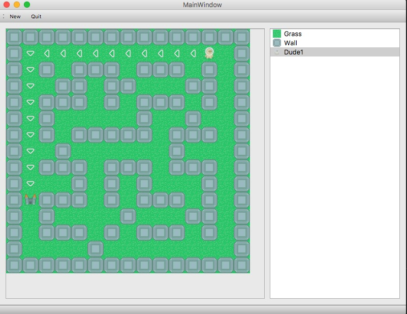

# maze
A Python/Cython maze generator and solver using [numpy](http://www.numpy.org/) for computing and [PyQT5](https://wiki.python.org/moin/PyQt) for GUI. 

This is just a demo for future maze game using a public domain graphics from [OpenGameArt](https://opengameart.org/users/kenney). 

For now, after a maze is generated, you can place a dude and the way to the targer castle will be computed.

You can also pick up and place a wall or grass.

## Installation
Just clone this repo, install dependencies and run

`python -m maze`
